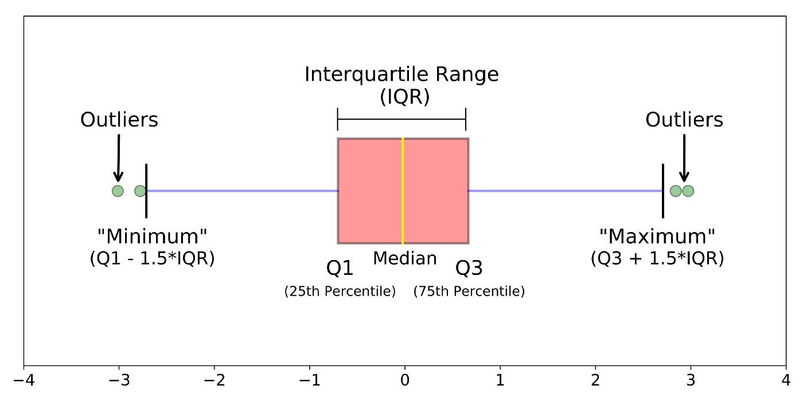

---
jupyter:
  jupytext:
    text_representation:
      extension: .md
      format_name: markdown
      format_version: '1.3'
      jupytext_version: 1.11.2
  kernelspec:
    display_name: Python 3
    language: python
    name: python3
---

```python
import warnings
warnings.simplefilter("ignore")

import pandas as pd
import numpy as np
import matplotlib.pyplot as plt
import math

from src.load_data import *
from src.graphs import *
from src.statistical_tests import *
from src.utils import *
```

<!-- #region -->
## Few notes:
* **total_clearance_between_visit** - wzgledem poprzedniej wizyty
* **clearance_between_visit** - wzgledem poczatku
* we group to **nereast** time group 


#### To-dos:
* Sprawdz ilosc grup z peaku w gory!
* Sprawdzic linear fit i non-linear fit
* Sprawdz rozne 
* Sprawdz methodologie
* Sila statystyczna (p-value)
* Sprawdz rozne kwartaly
* Pogrobic linie

#### Few **old** notes:
* The table above should include all information You need
* `wizyta po ilu zabiegach` -> can have some skipped zabiegy & can start at other point than 0
* `czas` -> defined as czas between this and next visit


<!-- #endregion -->

# Hard-Coded Area:

```python
import scipy.stats as stats
from statsmodels.stats.multicomp import MultiComparison
from collections import OrderedDict
from scipy.stats import ttest_rel as ttest_related
from scipy.stats import ttest_ind as ttest_not_related
from statistics import mean

df = get_data(format_type='all', remove_minus_ones = False)
bucket_column = 'visit_number'
# variable_column = "total_clearence_in_between_visits" 
variable_column = 'total_clearence_in_respect_to_beginning'

buckets = 'default'
limit = 20
increment = 3


buckets = [i for i in range(0,limit + 1, increment)]
buckets = [0,3,6,10,15]
data_dict = {}
data_2d_arr = []
for i in range(len(buckets) - 1):
    bucket_min = buckets[i]
    bucket_max = buckets[i+1]
    bucket_range = f"{bucket_min} - {bucket_max - 1}"

    visits_data = list(df.loc[(df[bucket_column] >= bucket_min) & (df[bucket_column] < bucket_max)][variable_column])
    data_dict[bucket_range] = visits_data
    data_2d_arr.append(visits_data)

# model = ols("observations ~ C(cotton_weight_percent)", df).fit()
# res = anova_lm(model, typ=1)

stats, p_value = stats.f_oneway(*data_2d_arr)
print('\n\n\n')
print('anova results:')
print(f'buckets: {buckets}')
print(f'p_value: {p_value}\n')


to_be_plot_data = []
dict_len = len(data_dict)
means = []
p_values = []
prev_data = ''
prev_bucket_range = ''
bucket_ranges = []
for bucket_range, data in data_dict.items():
    if bucket_range == '0 - 2':
        bucket_range = '1 - 2'

    means.append(round(mean(data),2))
    bucket_ranges.append(bucket_range)
    if prev_data == '' :
        prev_data = data
        prev_bucket_range = bucket_range
        continue

    left_mean = round(mean(prev_data),2)
    right_mean = round(mean(data),2)
    statistics, p_value = ttest_not_related(prev_data, data, alternative= 'less')
    p_value = round(p_value,5)
    print(f'statistics between {prev_bucket_range} bucket and {bucket_range} bucket')
    print(f'means: {left_mean} vs {right_mean}')
    print(f"p-value: {p_value}\n")
    p_values.append(p_value)
    to_be_plot_data.append([bucket_range, left_mean, right_mean, p_value])

    prev_data = data
    prev_bucket_range = bucket_range
```

```python
# Move it to func

# p_values[2] = 'n.s.'
plt.figure(figsize=(20,10))

index = 1
x_ticks = []

buckets = []
for i, bucket_range in enumerate(bucket_ranges):
    if i == 0 or i == len(bucket_ranges) - 1:
        buckets.append(bucket_range)
    else : 
        buckets.append(bucket_range)
        buckets.append(bucket_range)


for i, mean in enumerate(means):
    X_AXIS_INCREMENT = 0.5
    BREAK_INCREMENT = 2

    if index == 1:
        X_axis_index = X_AXIS_INCREMENT * index
        data = mean

    elif i == len(means) - 1 :
        X_axis_index = X_AXIS_INCREMENT * index
        data = mean

    else :
        X_axis_index = [index * X_AXIS_INCREMENT, (index + 2) * X_AXIS_INCREMENT ]
        data = [mean, mean]
        index += BREAK_INCREMENT

    plt.bar(X_axis_index, data, 0.4)
    # print(X_axis_index)
    index += 1


    # Get ticks
    if type(X_axis_index) == list:
        for i in X_axis_index:
            x_ticks.append(i)
    else :
        x_ticks.append(X_axis_index)


    
plt.xticks(x_ticks, buckets)
plt.xlabel('number of laser sessions (clustered into buckets)', fontsize=17)
plt.ylabel('% mean improvement\n(total clearance)\n', fontsize=19)

ax = plt.gca()


labels_places = []
for i in range(len(x_ticks) - 1):
    if i%2 == 1:
        continue
    before = x_ticks[i]
    after = x_ticks[i+1]
    label_place = (before+after)/2
    labels_places.append(label_place)


for label, p_value  in zip(labels_places, p_values):
    height = 54.50
    if p_value == 'n.s.':
        text = 'n.s.'
    else : 
        text = f"p-value: {p_value}"
    ax.text(
        label, height, text, ha="center", va="bottom", size = 18
    )
ax = plt.gca()
for label in (ax.get_xticklabels() + ax.get_yticklabels()):
	label.set_fontsize(14.5)

plt.show()
```

```python
non_moved_df = get_data(format_type='all')
moved_df = get_data(format_type='moved_to_0')
non0s_df = get_data(format_type='all_without_0s')

print('looking at the moved data:')
moved_df.head(10)
```

### Wyniki - totalna poprawa:

```python
get_stats_for_abstract(df = None, format_type = 'all')
```

```python
get_stats_for_abstract2(df = None, format_type = 'all', visit_number_buckets = [0,2,5,10,15,20])
```

```python
# Print some overall info such as:
# nr of people w. different number of visits
# nr of people in different waiting buckets
```

# Main Graphs
### Total clearence compared to start:

```python
plt.figure(figsize=(20,10))
data = get_data(format_type='all',remove_minus_ones = False )
data2 = get_data(format_type='moved_to_0',remove_minus_ones = False )
data3 = get_data(format_type='all_without_0s',remove_minus_ones = False )
agg_column_graph(data, label = 'data bez zmian', column = 'total_clearence_in_respect_to_beginning')
agg_column_graph(data2, label = 'data moved to 0', column = 'total_clearence_in_respect_to_beginning')
agg_column_graph(data3, label = 'data without patients without 1st visit', column = 'total_clearence_in_respect_to_beginning', title = 'title')
```

```python
plt.figure(figsize=(20,10))
data = get_data(format_type='all',remove_minus_ones = False )
agg_column_graph(data, agg = 'mean', label = '', column = 'total_clearence_in_respect_to_beginning', title = '', cut_last_x_visits = 27)
plt.axvline(x=2.5, color='b', linestyle='--')
plt.axvline(x=5.5, color='b', linestyle='--')
plt.axvline(x=14.5, color='b', linestyle='--')
plt.axvline(x=9.5, color='darkorange', linestyle='-',  lw = 9)

# Logaithmic and polynomial fits
# If the logathmic fit is the best fit
# Anova -> posthoc ttest ()
# Plot the scatter of data for better visibility 
# (try moving avg for smoothen avg)
```

```python
data = get_data(format_type='all',remove_minus_ones = True )
plt.figure(figsize=(20,10))
agg_column_graph(data, label = '', column = 'total_clearence_in_between_visits', title = 'mean total clearence in respect to previous visit over patients treatment', cut_last_x_visits = 26)
```

### Srednia poprawa miedzy wizytami:

```python
plt.figure(figsize=(20,10))
plt.title("srednia poprawa miedzy wizytami")
agg_column_graph(moved_df, label = 'data moved to 0s')
plt.legend()
```

```python
plt.figure(figsize=(20,10))
agg_column_graph(non_moved_df, label = 'data bez zmian', column = 'total_clearence_in_between_visits')
agg_column_graph(moved_df, label = 'data moved to 0s', column = 'total_clearence_in_between_visits')
agg_column_graph(non0s_df, label = 'data bez 0s', column = 'total_clearence_in_between_visits')
```

### Showcase of how tests works:

```python
data, expected_frequences = chi_squared_test(non_moved_df, name = 'example test', display_data = True)

```

```python
data.rename(columns = {0 : '1-90',
                       1 : '91-180',
                       2 : '181-270',
                       3 : '271 - 360',
                       4 : '361+',
                       
}, inplace = True)
data['type'] = 'frequencies'

expected_frequences = expected_frequences.rename(columns = {0 : '1-90',
                       1 : '91-180',
                       2 : '181-270',
                       3 : '271 - 360',
                       4 : '361+',
                       
}).round(2)
expected_frequences['type'] = 'expected_frequences'
```

```python

```

```python
display(data)
print('expected frequencies:')
display(expected_frequences)
print('Chi squred contigency test p-value: 0.014')
```

```python
expected_frequences
```

```python
plt.figure(figsize=(20,12))
time_group_based_avg_graph(moved_df, 
                           GROUPS = [0,10,20], 
                           increment = 10, 
                           display_data_for_chi_square_test = False, 
                           base_column = 'nr_visit_group',
                           column = 'total_clearence_in_between_visits')
```

```python
plt.figure(figsize=(20,12))
a = time_group_based_avg_graph(non_moved_df, 
                           GROUPS = [0,5,10,15,20], 
                           increment = 5, 
                           display_data_for_chi_square_test = False, 
                           base_column = 'nr_visit_group',
                           column = 'total_clearence_in_between_visits',
                           label = 'nie przesunieci')
time_group_based_avg_graph(moved_df, 
                           GROUPS = [0,5,10,15,20], 
                           increment = 5, 
                           display_data_for_chi_square_test = False, 
                           base_column = 'nr_visit_group',
                           column = 'total_clearence_in_between_visits',
                           label = 'przesunieci')

time_group_based_avg_graph(non0s_df, 
                           GROUPS = [0,5,10,15,20], 
                           increment = 5, 
                           display_data_for_chi_square_test = False, 
                           base_column = 'nr_visit_group',
                           column = 'total_clearence_in_between_visits',
                           label = 'usunieci bez 1 wizyty')
display(a)
plt.title('mean total_clearencs vs nr_visits group')
plt.xlabel('nr_visits_group')
```

## Time Group based avg graphs:
* Removed graphs for patients after 15th and 20th visit - since there is barely any data there

```python
graph_multiple_time_group_based_avg_graph(non_moved_df,blizsze = False, GROUPS = [0,100,200], increment = 100)
```

```python
graph_multiple_time_group_based_avg_graph(non_moved_df,blizsze = False, GROUPS = [0,200,400], increment = 200)
```

```python
# graph_multiple_time_group_based_avg_graph(non_moved_df,blizsze = False, GROUPS = [0,100,200,300], increment = 100) # I dont like this one
```

```python

```

## Answer to new question asked by Professor:
mam pytanie do Janka, tak jak zobaczyliśmy, że lepiej jest robić wizyty co 90-180 dni czyli co mniej więcej 180 dni, moje pytanie o to czy w fazie do 9 wizyt warto jest robić zabiegi co 4 tygodnie tak jak prosimy czy może jednak co 90 dni. Jest chińska praca na dzieciach, która sugeruje, że co 6 tygodni jest lepiej niż co 2 (ten sam efekt po 3 vs 6 zabiegach) w tym samym czasie. te rozbieżności były zawsze, ale może można spróbować wyszukać optymalnej częstotliwości na podstawie naszych danych?

```python
print([i*56 for i in range(50)])
```

```python
def answer():
    data = get_data(format_type='all',remove_minus_ones = True )
    # data_up_to_9th = data.loc[data.visit_number <= 9]
    # data_up_to_5th = data.loc[data.visit_number <= 5]
    # data_up_to_15th = data.loc[data.visit_number <= 15]
    a = graph_multiple_time_group_based_avg_graph(data, blizsze = True, GROUPS = [0,120,240,360], increment = 120, skip_linear_fit = True, wizyty_iteration = [29,15,9])
    # graph_multiple_time_group_based_avg_graph(data, blizsze = True, GROUPS = [0,90,180,270], increment = 90, skip_linear_fit = True, wizyty_iteration = [29,15,9])
    b = graph_multiple_time_group_based_avg_graph(data, blizsze = True, GROUPS = [0, 14, 28, 42, 56, 70, 84, 98, 112, 126, 140, 154, 168], increment = 14, skip_linear_fit = True, wizyty_iteration = [9,15,30])
    c = graph_multiple_time_group_based_avg_graph(data, blizsze = True, GROUPS = [0, 28, 56, 84, 112, 140, 168], increment = 28, skip_linear_fit = True, wizyty_iteration = [9,15,30])
    d = graph_multiple_time_group_based_avg_graph(data, blizsze = True, GROUPS = [0, 56, 112, 168], increment = 56, skip_linear_fit = True, wizyty_iteration = [9,15,30])
    return a,b,c,d


a,b,c,d = answer()
```

```python
display(a)
display(d)
display(c)
display(b)
```

## --- End of the quick answer

```python

```

```python

```

```python

```

```python
data = get_data(format_type='all',remove_minus_ones = True )
graph_multiple_time_group_based_avg_graph(data,blizsze = False, GROUPS = [0,120,240,360], increment = 120, skip_linear_fit = True, wizyty_iteration = [5,0])
```

```python
graph_multiple_time_group_based_avg_graph(non_moved_df,blizsze = False, GROUPS = [0,90,180,270,360], increment=90)
```

```python
graph_multiple_time_group_based_avg_graph(non_moved_df,blizsze = False, GROUPS = [0,30,60,90,120,150,180,210,240,270,300,330,360], increment=30)
```

### All users plots:

```python
# plot_all_users(non_moved_df, title = 'data bez zmian')
# plot_all_users(moved_df, title = 'data moved to 0s')
# plot_all_users(non0s_df, title = 'data bez 0s')
```

```python
plt.figure(figsize=(20,12))
scatter_plot_against_time(non_moved_df, label = 'before or 5th visit', label2 ='line fit to ALL data' ,plot_linear_fit = False)
```

## Scatter plots - dependent on visit:

```python
plt.figure(figsize=(20,12))
scatter_plot_against_time(non_moved_df.loc[non_moved_df['visit_number'] > 2], label = 'before or 5th visit', label2 ='line fit to ALL data' ,plot_linear_fit = True)
```

## Scatter plots - dependent on visit:

```python
plt.figure(figsize=(30,15))

df1 = non_moved_df.loc[non_moved_df['visit_number'].isin([1,2])]
df2 = non_moved_df.loc[non_moved_df['visit_number'].isin([3,4,5])]
df3 = non_moved_df.loc[non_moved_df['visit_number'].isin([6,7,8,9,10,11,12,13])]
df5 = non_moved_df.loc[non_moved_df['visit_number'] > 13]


scatter_plot_against_time(df1, label = 'visit nr 0-2', plot_linear_fit= False)
scatter_plot_against_time(df2, label = 'visit nr 3-5', plot_linear_fit= False)
scatter_plot_against_time(df3, label = 'visit nr 6-13', plot_linear_fit= False)
scatter_plot_against_time(df5, label = 'visit nr 13+', plot_linear_fit= False)
plt.legend()
```

```python
# weird_data = non_moved_df.loc[(non_moved_df['below 0'] == True) & (non_moved_df['time'] <75)] # Send to Michal & Professor
# weird_data.to_excel('dziwne_badania.xlsx')
```

```python
plt.figure(figsize=(20,12))
scatter_plot_against_time(non_moved_df, label = 'before or 2th visit', label2 ='line fit to ALL data')
scatter_plot_against_time(non_moved_df.loc[non_moved_df['visit_number'] > 2], label = 'after 2th visit', label2= 'line fit to 2+ visits data')
plt.legend()
```

```python
print('If time was longer than 360 I changed it to 360 to keep graph readable \n')

plt.figure(figsize=(20,12))
scatter_plot_against_time(non_moved_df, label = 'before or 5th visit', label2 ='line fit to ALL data')
scatter_plot_against_time(non_moved_df.loc[non_moved_df['visit_number'] > 5], label = 'after 5th visit', label2= 'line fit to 5+ visits data')
plt.legend()
```

```python
plt.figure(figsize=(20,12))
scatter_plot_against_time(non_moved_df, label = 'before or 10th visit', label2 ='line fit to ALL data')
scatter_plot_against_time(non_moved_df.loc[non_moved_df['visit_number'] > 10], label = 'after 10th visit', label2= 'line fit to 10+ visits data')
plt.legend()
```

```python
plt.figure(figsize=(20,12))
scatter_plot_against_time(non_moved_df, label = 'before or 15th visit', label2 ='line fit to ALL data')
scatter_plot_against_time(non_moved_df.loc[non_moved_df['visit_number'] > 15], label = 'after 15th visit', label2= 'line fit to 15+ visits data')
plt.legend()
```

### Scatted plots - divided into time groups:

```python
plt.figure(figsize=(12,12))
df0 = non_moved_df
df1 = non_moved_df.loc[non_moved_df['time'] > 90]
df2 = non_moved_df.loc[non_moved_df['time'] > 180]
df3 = non_moved_df.loc[non_moved_df['time'] > 270]
df4 = non_moved_df.loc[non_moved_df['time'] > 360]


scatter_plot_against_time(df0, label = 'all data points', label2 ='line fit to ALL data',plot_linear_fit = False)
scatter_plot_against_time(df1, label = 'days passed > 90', label2 ='',plot_linear_fit = False)
scatter_plot_against_time(df2, label = 'days passed > 180', label2 ='',plot_linear_fit = False)
scatter_plot_against_time(df3, label = 'days passed > 270', label2 ='',plot_linear_fit = False)
scatter_plot_against_time(df4, label = 'days passed > 360', label2 ='',plot_linear_fit = False)
plt.legend()
```

```python
plt.figure(figsize=(12,12))
df0 = non_moved_df
df1 = non_moved_df.loc[non_moved_df['time'] > 90]
df2 = non_moved_df.loc[non_moved_df['time'] > 180]
df3 = non_moved_df.loc[non_moved_df['time'] > 270]


scatter_plot_against_time(df0, label = 'all data points', label2 ='line fit to ALL data')
scatter_plot_against_time(df1, label = 'days passed > 90', label2 ='')
scatter_plot_against_time(df2, label = 'days passed > 180', label2 ='')
scatter_plot_against_time(df3, label = 'days passed > 270', label2 ='')
plt.legend()
```

## Scatter plots - clearnce vs visit_nr

```python
plt.figure(figsize=(12,12))
scatter_plot_against_visit_nr(non_moved_df, label = 'all  visits', label2 ='line fit to ALL data')
plt.legend()
```

##### Botplox explained:


```python
plt.figure(figsize=(12,12))
scatter_plot_against_visit_nr(non_moved_df, label = 'all  visits', label2 ='line fit to ALL data', plot_type='box', plot_linear_fit = False)
plt.legend()
```

```python
plt.figure(figsize=(12,12))
scatter_plot_against_visit_nr(non_moved_df, label = 'all  visits', label2 ='line fit to ALL data', plot_type='box', plot_linear_fit = True)
plt.legend()
```

### Statistical comparison of the means between 2 samples (data divided based on time)

```python
non_moved_df
```

```python

for days_passed_threshold in [60,120,180,240,300,360]:
    print()
    ttest_against_time_threshold(non_moved_df, 
                                 time_threshold = days_passed_threshold, 
                                 related_ttest = False)

```

```python

```

### Statistical comparison of the means between 2 samples (data divided based on nr of visits)

```python
1-3 -> srednia
4-6 -> srednia
7-9 -> srednia
10-13 -> srednia

wzgledne i bezwgledne statystyki (ttest independent and dependent)
```

```python
for visit_nr_threshold in [2,5,6,7,8,9,10,15,20,25]:
    print(f'TEST FOR FOR NR VISITORS: {visit_nr_threshold}')
    ttest_against_time_threshold(non_moved_df,
                                 visit_nr_threshold=visit_nr_threshold, 
                                 related_ttest = False)
                                 
    # ttest_against_time_threshold(non_moved_df,
    #                              visit_nr_threshold=visit_nr_threshold, 
    #                              related_ttest = True)
    print('\n\n\n')
```

# Exploratory area:


### New task by professor:
`Sprawdzic czy pierwsze dwie wizyty po x dlugosci czasu (90, 180, 270, 360 dni) maja dobre wymiary - tak jak pierwsze dwie wizyty → range for the beginning and the end`

```python
non_moved_df = get_data(format_type='all')
after_function = get_visits_after_wait_time_x(non_moved_df, 120)
```

```python
plt.figure(figsize=(20,10))
data = get_data(format_type='all',remove_minus_ones = False)

data = get_visits_after_wait_time_x(data, 90)
data2 = get_visits_after_wait_time_x(data, 120)
data3 = get_visits_after_wait_time_x(data, 180)
data4 = get_visits_after_wait_time_x(data, 270)
data5 = get_visits_after_wait_time_x(data, 360)


agg_column_graph(data, label = 'data - moved by 90d', column = 'total_clearence_in_respect_to_beginning')
agg_column_graph(data2, label = 'data - moved by 120d', column = 'total_clearence_in_respect_to_beginning')
agg_column_graph(data3, label = 'data - moved by 180d', column = 'total_clearence_in_respect_to_beginning')
agg_column_graph(data4, label = 'data - moved by 270d', column = 'total_clearence_in_respect_to_beginning')
agg_column_graph(data5, label = 'data - moved by 360d', column = 'total_clearence_in_respect_to_beginning')
```

## Next steps (to be done by the end of the week)
1. Double check the data (try to automate it and then compare, or just look by the eye)
2. Add 4 new columns (changes in colours/area compared to beginning/previous visit)
3. Double check all calculations
4. Look into further statistics


